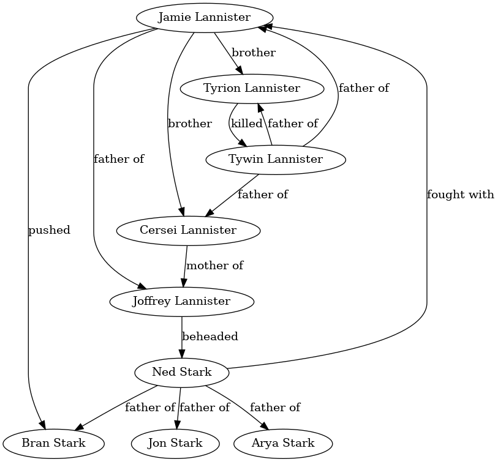

# 1. D&D-NLP-KG: Create a knowledge graph of your D&D notes using natural language processing<!-- omit in toc -->

[](https://github.com/SootyOwl/dnd-nlp-kg/actions/workflows/flake8-black-pytest.yml)

- [1.1. Introduction and Intent](#11-introduction-and-intent)
- [Installation](#installation)
- [Inspiration](#inspiration)
- [Example of a knowledge graph](#example-of-a-knowledge-graph)

## 1.1. Introduction and Intent

I'm always looking to improve my DM notes. I recently started using a directed graph to keep track of various relationships between entities in my D&D campaign, and found it very helpful. However, the tool I used to create the graph was cumbersome and not designed specifically for notetaking.

I thought I could do better, so I was sucked into the world of knowledge graphs and natural language processing. I found tools such as Roam Research and Obsidian.md which were closer to what I was looking for, however these, too, were lacking some features that I thought would be useful. I wanted a way to automatically extract the relationships in my notes and display them in a graph. After some research into natural language processing, this project was born.

The main features I am planning on implementing are:

- A markdown note-taking tool
- NLP using SpaCy to extract relationship triples from the notes
- A display of entities from the notes (NPCs, Towns, etc.) in the form of a directed graph, the edges being the relationships between pairs of entities

## Installation

```console
poetry install
poetry run python -m spacy download en_core_web_sm
poetry run python -m coreferee install en
```

## Inspiration

<https://github.com/NSchrading/intro-spacy-nlp/blob/master/subject_object_extraction.py>

## Example of a knowledge graph

This was generated from hand-written SVO triples by the code in `vis.py`


